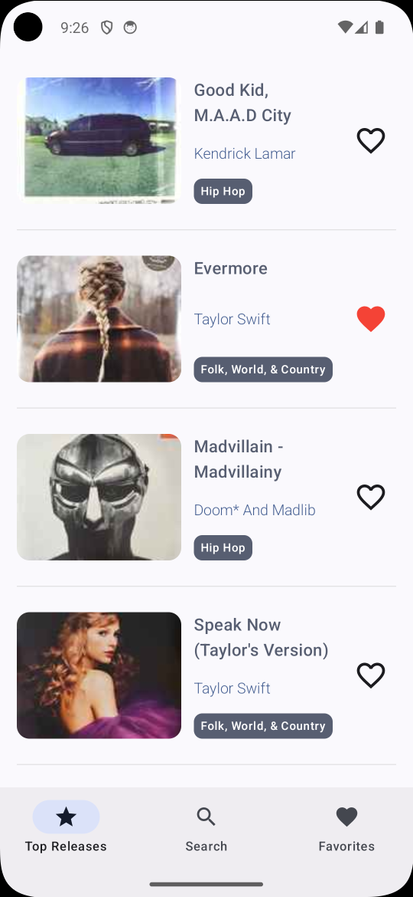

# DiscogsViewer

Приложение для просмотра музыкальных релизов через Discogs API.
токен можно получить [здесь](https://www.discogs.com/settings/developers).

## Описание
Выпускной проект по Android курсу от Otus.

DiscogsViewer — Android-приложение, позволяющее просматривать топ релизов, осуществлять поиск, а также добавлять релизы в избранное. Приложение построено на модульной архитектуре с четким разделением ответственности между слоями.

Основные экраны:

- **Top Releases** — список топовых релизов с поддержкой pull-to-refresh и пагинации
- **Search** — поиск релизов с историей поисковых запросов
- **Favorites** — избранное с фильтрацией по жанрам и сортировкой
- **Details** — детальный просмотр выбранного релиза
- **Settings** — настройки приложения (тема)

## Скриншоты



## Использованный стек

| Область           | Технология                                      |
|------------------ |--------------------------------------------------|
| Language          | Kotlin 2.0.21                                    |
| UI                | Jetpack Compose + Material 3                     |
| Architecture      | Модульная (core / data / feature)                |
| DI                | Hilt (2.57.1) + kapt                             |
| Network           | Ktor (2.3.12) + kotlinx-serialization            |
| Database          | Room (2.8.4) + Paging 3                         |
| Storage           | DataStore Preferences                            |
| Image loading     | Coil (2.4.0)                                     |
| Navigation        | Jetpack Navigation Compose (2.8.9)               |
| Concurrency       | Kotlin Coroutines                                |
| Testing           | JUnit 4, Mockk, Turbine, Coroutines Test         |
| Build             | AGP 8.13.2, Gradle Version Catalog               |
| Target SDK        | 35 (Vanilla Ice Cream) / minSdk 24               |

## Схема модулей

```
DiscogsViewer
┌──────────────────────────────────────────────────────┐
│  :app                                                │
│  └── MainActivity, MainNavigation, Theme, ScreenRoute │
└────┬──────────┬──────────┬──────────┬──────────┬─────┘
     │          │          │          │          │
     ▼          ▼          ▼          ▼          ▼
┌─────────┐┌────────┐┌─────────┐┌──────────┐┌──────────┐
│:feature:││:feature││:feature:││:feature: ││:feature: │
│releases ││search  ││favorites││details   ││settings  │
└────┬────┘└───┬────┘└────┬────┘└────┬─────┘└────┬─────┘
     │         │          │          │           │
     └─────┬───┴──────┬───┴──────────┴───────────┘
           │          │
     ┌─────┴────┐ ┌───┴────────────────────────┐
     │ :data:   │ │ :core:basepresentation      │
     │ releases │ │ (ScreenRouter,              │
     │ search   │ │  ReleaseCardState,          │
     │ favorite │ │  SharedTheme)               │
     │ settings │ └─────────────────────────────┘
     └────┬─────┘
          │
     ┌────┴──────────────────────────┐
     │  :core:                       │
     │  network  (Ktor, DTOs)        │
     │  database (Room, DAOs, DBOs)  │
     │  di       (Hilt modules)      │
     └───────────────────────────────┘

Dependency direction:
  app → feature/* → data/* → core/*
                     ↳ core:basepresentation
```

### Описание слоев

- **core/** — общедоступная инфраструктура: сетевой клиент, база данных, DI-конфигурация, общие UI-модели
- **data/** — репозитории с маппингом DTO/DBO → domain-модели; данные не утекают в feature-слой
- **feature/** — UI-экраны, ViewModels, use cases и навигационные entry-points
- **app/** — точка входа: MainActivity, NavHost, навигационные маршруты, тема

## Запуск

```bash
./gradlew assembleDebug
```
